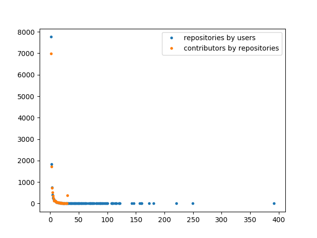
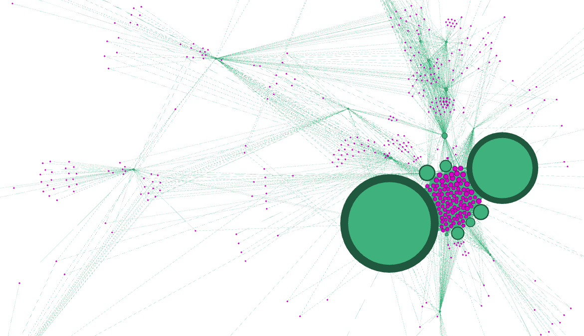
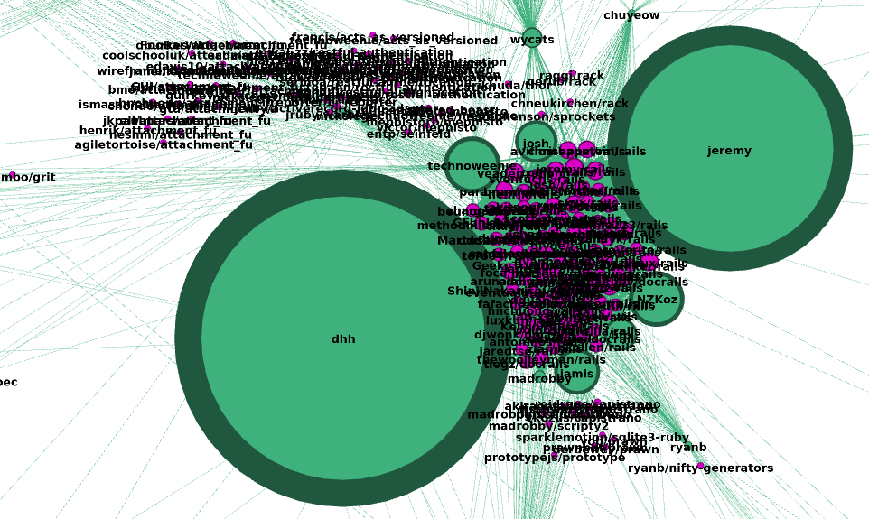

# GitHub graph visualization using Gephi

This is the second part of <a href="part1.html">this post</a> where I
describe how to fetch user and repository data directly from GitHub.

In this part, we are going to try to plot a graph that represents a part
of GitHub using <a href="https://gephi.org/">Gephi</a>.

## Prerequisite

I used <a href="https://github.com/PaulBreugnot/GraphGitHub">the Python package relative to this post</a>
to exploit APIs, as described in <a href="https://paulbreugnot.github.io/GraphGitHub/">the first part</a>. (see [this example](https://github.com/PaulBreugnot/GraphGitHub/blob/master/examples/rest_api_example.py))

But because Gephi mainly uses <em>csv</em> files has input,
you are quite free to use the method of your choice if you want to
reproduce some parts of this analysis.

## Dataset
### Description

Using the GitHub REST API, I fetched the 15,000 first repositories returned
by the REST API and all their contributors, what represents 12,397 users and
42,083 contributions.

All those results are stored in 3 .csv files, with the following fields :

* <em>repositories.csv</em>
  * id
  * full_name
* <em>users.csv</em>
  * id
  * login
* <em>contributions.csv</em>
  * id_repository
  * id_user
  * contributions <em>(number of contributions by this user to this repository)</em>

Those data (from REST, including cleaned data, and from GraphQL, are available in the [examples/datasets folder](https://github.com/PaulBreugnot/GraphGitHub/tree/master/examples).

### Gephi input

However, Gephi can't really take those three <em>csv</em> as direct input,
at least for what we want to do. Instead, it's better to convert them into
2 <em>csv</em> with the following characteristics :

* <em>nodes.csv</em>
  * id
  * label <em>(in our case, users' login and repositories' full names)</em>
  * type <em>(<em>user</em> or <em>repository</em>)</em>
* <em>edges.csv</em>
  * Source <em>(user id)</em>
  * Target <em>(repositorie id)</em>
  * Weight <em>(our previous <em>contributions</em> field)</em>
  
Obviously I performed all those conversions using Python, and you can do
the same using my package if you want.

An important things is that to be able to perform operations (such as
coloring for example) on nodes of different type using Gephi, they all
need to be in the same file with a "type" attribute that you will use to
distinguish nodes. The problem is that to make this work, we need to
convert users and repositories id to ensure that all the final ids in the
final file are unique, and convert the contributions accordingly in the
final <em>edges.csv</em> file. One more time, Python will be your friend,
but do not hesitate to check my code if you need help.

### Data cleaning

If we tried to put this original dataset into Gephi, we would have 27,397
nodes and 42,083 to process. Actually, that's quite big for Gephi, and
anyway there are a lot of insignificant data in this dataset.

So what I did is that I removed all the users that have contributed to less
than 100 repositories, and removed all the repositories with less than 10
contributors, and then we also removed all nodes that left without
connections after those operations.

Actually that's quite arbitrary, but you are free to test different
parameters to try different cleaning if you want. ;-) Distributions plots
that I implemented can also help you. (see an example to plot distributions and clean data [just there](https://github.com/PaulBreugnot/GraphGitHub/blob/master/examples/data_cleaning_example.py)

Anyway, I finally obtained 537 nodes for 2,023 connections, what is more
reasonable.

### Using Gephi

I'm not going to detail all the steps I performed to reach my final graph,
because I basically just followed <a href="http://www.martingrandjean.ch/gephi-introduction/">this very good tutorial</a>
by Martin Grandjean that will help you start with Gephi.

Once you have the good .csv files, you actually just need to play with the
parameters until reaching a pretty graph. ;-)

And so, finally <strong>HERE IS MINE!!!</strong>

OK, it's not that pretty. But it is actually quite interesting!

Green nodes are users, purples are repositories, and the size of nodes
depends on the contributions weights. But what could be this big cluster
at the center???

Let's add labels to the graph:

Let's check who can be that <em>dhh</em> with its thousands
of contributions... -> <a href="https://dhh.dk/">https://dhh.dk/</a>

<em>"I am the creator of Ruby On Rails"</em>

Oh, really? Indeed, if we have a closer look at the repository cluster, we
can see that they are nearly all <a href="https://github.com/rails/rails">rails repository forks!</a>
Also, <a href="https://github.com/jeremy">jeremy</a>
, the other big node, is actually also a big rails contributor.
So this graph is actually quite relevant.

### Conclusion

My results finally only focus on the "first" 15,000 GitHub repositories,
what is absolutely nothing considering the nearly 40,000,000 repositories...

Anyway, it would not be possible and even not interesting to fetch
<strong>ALL</strong> GitHub's data and to try to display it in Gephi...
But I consider this project as a great proof of concept of what could be
done using GitHub's API and graph visualization, because actually I think
it could be really interesting to use the same concepts to expand the graph
from a particular user or repository (what would this time perfectly fit
with the REST or GraphQL APIs use cases!) to visualize important contributions
and dependencies using Gephi, what could (on top of satisfying our own
curiosities) help to organize development strength around projects and
users.

So I am <strong>finally</strong> done with this article! Thanks for
reading me, and do not hesitate to contribute or comment with some
ideas! ;-)
